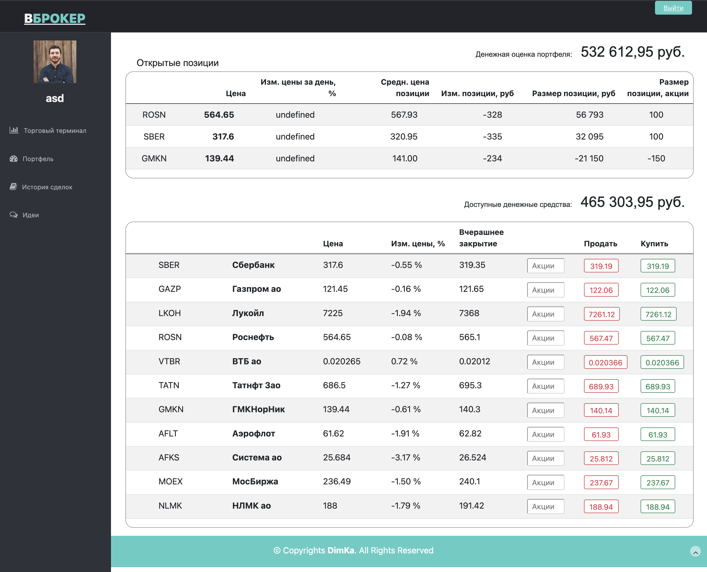
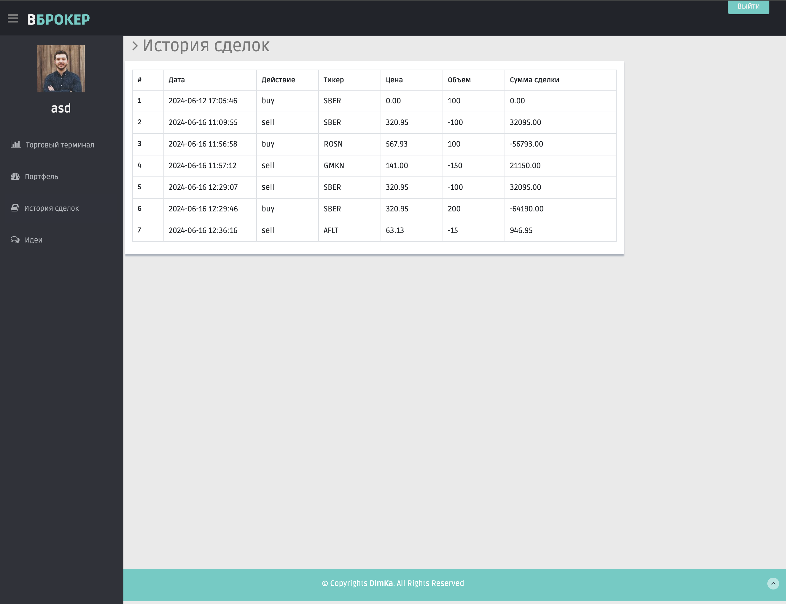
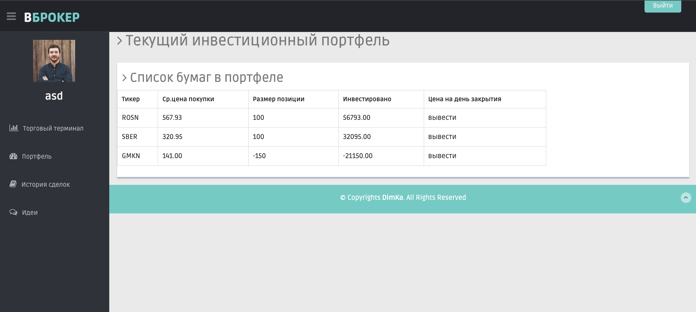

# Stock broker emulator

## Эмулятор торгового брокера фондового рынка
###  <a href="http://www.brokerem.byethost12.com/" >http://www.brokerem.byethost12.com</a>
 

Эмулятор позволяет после авторизации торговать виртуальными акциями по реальным котировкам фондового рынка.
Котировки парсерятся с сайта в открытом доступе.  
Есть разделы с историей сделок и текущим портфелем акций.
Фронт сделан на JavaScript, бэк на PHP. Обмен между ними осуществляется черех JSON.
 

### Страница авторизации

  

### Торговый терминал

  

### История сделок

  

### Список акций в портфеле

  

